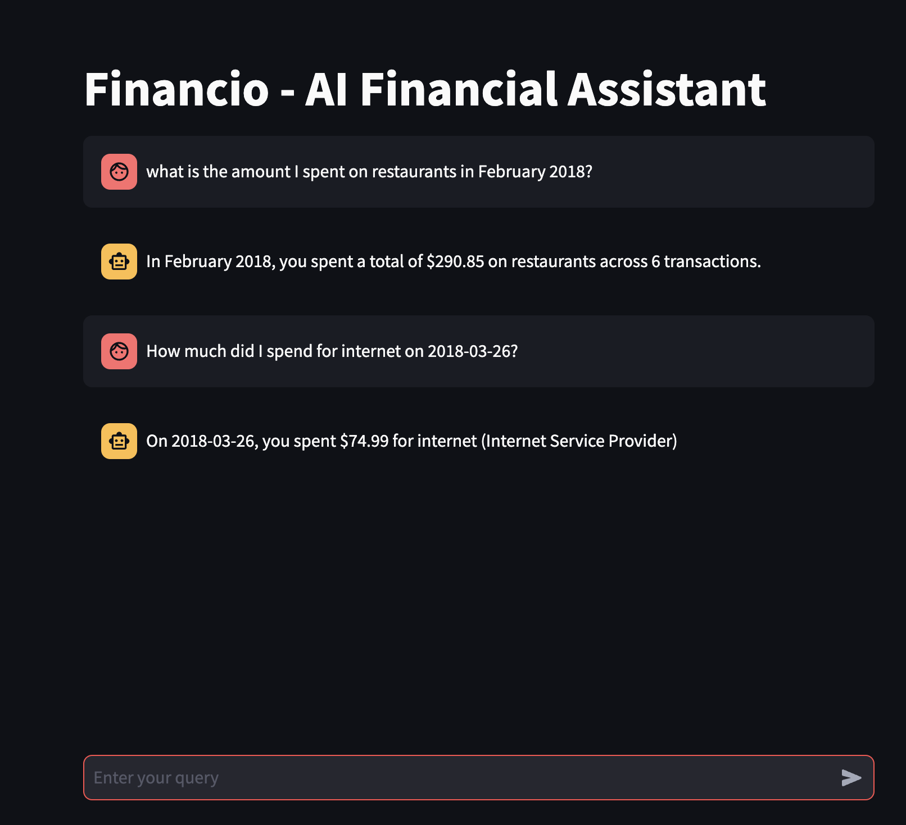
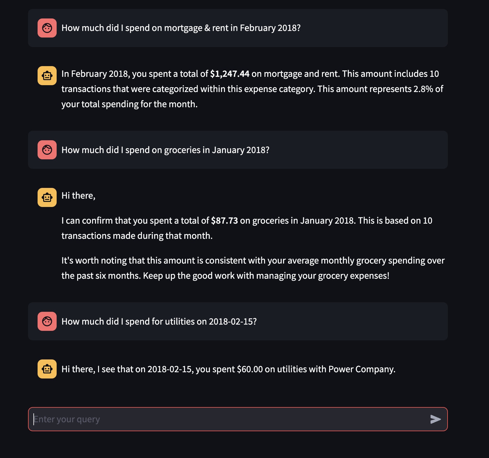

# Financial-chatbot
Financio is an AI-powered chatbot designed to help users track their finances, suggest optimal spending limits, and provide personalized insights based on previous transaction history.  Resources

Financio is an AI-powered RAG chatbot designed to help users track their finances, and provide personalized insights based on previous transaction history. This system integrates:

✅ Retrieval-Augmented Generation (RAG) for financial query responses 

✅ Pinecone for fast vector-based similarity searches 

✅ FastAPI for backend processing 

✅ Streamlit for an interactive front-end UI 

✅ Azure SQL for structured transaction storage 

✅ Terraform & Kubernetes for scalable deployment

🚀 Features

    🔹 Smart Transaction Search: Retrieve past transactions using entity extraction (vendor, date, category, amount).
    
    🔹 Financial Goal Planning: Helps users save a target amount by adjusting spending habits.
    
    🔹 Fast Similarity Search: Uses Pinecone to match user queries with relevant financial data.

1️⃣ Clone the Repository git clone https://github.com/kushaliharish-wq/Financio.git

2️⃣ Create and Activate Virtual Environment

    python -m venv venv source venv/bin/activate # On macOS/Linux venv\Scripts\activate # On Windows

3️⃣ Install Dependencies

4️⃣ Set Up Environment Variables

Create a .env file in the root directory and add:
    
    PINECONE_API_KEY=your_pinecone_api_key 
    
    AZURE_SQL_CONNECTION_STRING=your_azure_sql_connection 
    
    OPENAI_API_KEY=your_openai_api_key

5️⃣ Set up terraform infra(Azure SQL resource group, SQL server and SQL database)

    Run terraform init ➡️ terraform plan ➡️ terraform apply
    
6️⃣ Ingest data into infrastructure by running data_ingestion.py

7️⃣ Embed data using Pinecone Vector Databse by running pinecone_sync.py

7️⃣ Set up backend by running following command:

    cd app/backend
    uvicorn backend:app --reload

8️⃣ Start the Streamlit UI

    cd app/frontend
    streamlit run chatbot.py

🧠 How It Works

    1️⃣ Azure SQL Database setup
    
    2️⃣ Data Ingestion (data_ingestion.py)
    
        Cleans and preprocesses financial transaction data from Azure SQL.
        Converts transactions into embeddings using Sentence Transformers.
    
    3️⃣ Indexing with Pinecone (pinecone_sync.py)
    
        Uploads embeddings into Pinecone for fast vector search.
        Enables similarity-based financial recommendations.
    
    4️⃣ FastAPI Backend (backend.py)
    
        Processes user queries.
        Fetches relevant transactions via similarity search.
        Integrates GPT-based RAG for financial insights.
    
    5️⃣ Streamlit UI (chatbot.py)
    
        Provides an interactive chatbot interface.
        
        Displays transaction summaries and insights.
        
        Allows users to ask finance-related queries.

## Screenshots  

  

  

  

🛡️ Security Best Practices
    
    🔹 Never push .env files to GitHub (use .gitignore) 
    
    🔹 Limit API key exposure using environment variables 
    
    🔹 Use role-based access control (RBAC) for database queries

🤝 Contributing

Want to improve Financio? Follow these steps:

    Fork the repo
    
    Create a new branch (feature-new-feature)
    
    Commit changes

    Push to GitHub & create a PR

📌 Future Enhancements

    🔹 Expense Predictions with AI - Predict future spending trends
    
    🔹 Personalized Recommendations - Connect to your personal banking account to get real time data using Kafka, performing necessary data preprocessing and create a hyper-personalized chatbot

📞 Contact & Support

💡 Have suggestions or issues? Feel free to open a GitHub issue or reach out!

📧 Email: kushaliharish@gmail.com 🔗 LinkedIn: https://www.linkedin.com/in/kushali-harish-481000168/

